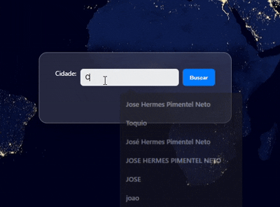

# 🌍 World Time App

<div align="center">



[](https://neto13k.github.io/world-time-app/)
[](https://developer.mozilla.org/en-US/docs/Web/HTML)
[](https://developer.mozilla.org/en-US/docs/Web/CSS)
[](https://developer.mozilla.org/en-US/docs/Web/JavaScript)
[](LICENSE)

**[🚀 Ver Demo ao Vivo](https://neto13k.github.io/world-time-app/)**

</div>

---


Aplicação web que exibe o horário atual em qualquer cidade do mundo em tempo real. Digite o nome de uma cidade e veja o fuso horário correto atualizado a cada segundo.

### ✨ Funcionalidades

- 🔍 **Busca por cidade** — encontra qualquer cidade do mundo pelo nome
- 🕐 **Relógio em tempo real** — atualizado automaticamente a cada segundo
- 📅 **Data e hora completas** — exibição formatada em português
- 🌐 **Fuso horário automático** — detectado via geolocalização da cidade
- 🎨 **Interface glassmorphism** — visual moderno com fundo de mapa-múndi
- 📱 **Layout responsivo** — funciona em desktop e mobile

### 🛠️ Tecnologias

| Tecnologia | Uso |
|---|---|
| HTML5 | Estrutura da página |
| CSS3 | Estilização e glassmorphism |
| JavaScript (ES6+) | Lógica, fetch de APIs e manipulação de datas |
| [Open-Meteo Geocoding API](https://open-meteo.com/) | Busca de coordenadas por nome de cidade |
| [Open-Meteo Forecast API](https://open-meteo.com/) | Detecção automática de fuso horário |
| `Intl.DateTimeFormat` | Formatação de data/hora por timezone |
| GitHub Pages | Hospedagem e deploy contínuo |

### 🚀 Deploy

A aplicação está hospedada no GitHub Pages e atualizada automaticamente a cada push na branch `main`:

👉 **[https://neto13k.github.io/world-time-app/](https://neto13k.github.io/world-time-app/)**

### ⚙️ Como executar localmente

Clone o repositório:

```bash
git clone https://github.com/Neto13k/world-time-app.git
cd world-time-app
```

Abra o arquivo **index.html** diretamente no navegador — nenhuma dependência ou instalação necessária.

### 📂 Estrutura do Projeto

```
world-time-app/
│
├── .github/
│   └── workflows/
│       └── static.yml       # Pipeline de deploy automático (GitHub Pages)
│
├── assets/
│   ├── Gif/
│   │   └── demo.gif         # Demonstração animada
│   └── images/
│       └── mapa-mundi.jpg   # Imagem de fundo
│
├── index.html               # Estrutura da aplicação
├── script.js                # Lógica de busca e relógio
├── styles.css               # Estilização e layout
└── README.md
```

### 🔄 Como funciona

1. O usuário digita o nome de uma cidade e clica em **Buscar**
2. A API de geocoding da Open-Meteo retorna latitude, longitude e nome oficial
3. Com as coordenadas, a API de previsão retorna o fuso horário (`timezone`)
4. Um intervalo de 1 segundo atualiza a exibição usando `Intl.DateTimeFormat` com o timezone correto

## 👨‍💻 Autor

Desenvolvido por **José Hermes**

[](https://github.com/Neto13k)
